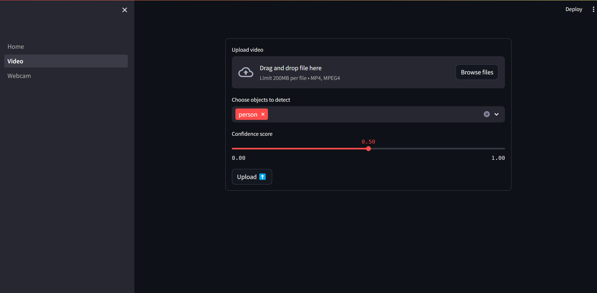
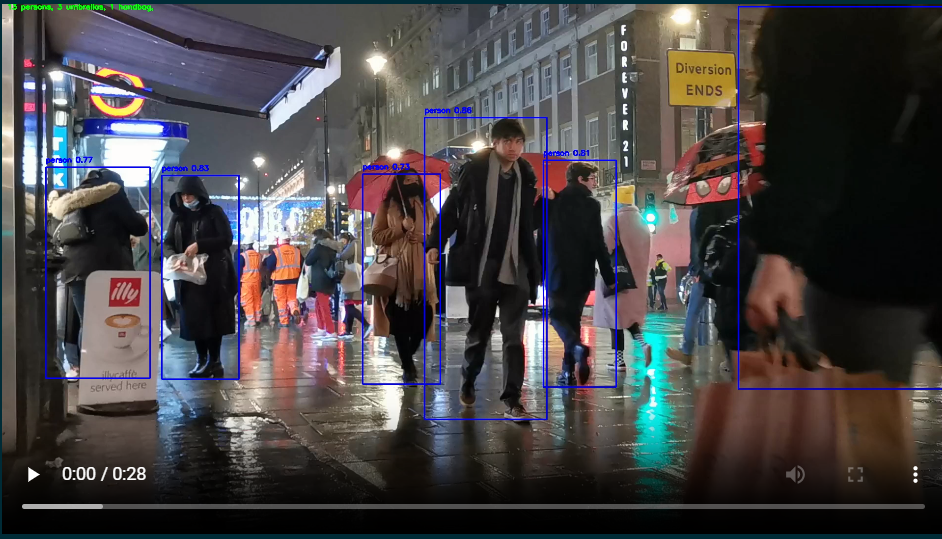

# Object Detection Web App

## Introduction
This project is a web-based object detection application powered by YOLOv8 and built with Streamlit. It enables users to upload videos and detect objects in real-time, leveraging the cutting-edge capabilities of the YOLO (You Only Look Once) deep learning model for object detection tasks. This app aims to provide a user-friendly interface for object detection, making it accessible to users without deep technical knowledge in deep learning or computer vision.

*Web App Interface*

## Features
- **Video Upload:** Users can upload video files for object detection.
- **Real-time Object Detection:** The app processes uploaded videos to detect and label objects using YOLOv8.

*Example of Object Detection in an Uploaded Video*

- **Customizable Detection Settings:** Users can select specific objects they want to detect and set the confidence score threshold for detections.
- **Webcam Support:** [If implemented] The app supports accessing the webcam for live object detection.

## Technologies Used
- **Python**: The primary programming language used for backend development.
- **Streamlit**: For creating the web interface.
- **YOLOv8**: Pre-trained model used for object detection.
- **OpenCV (cv2)**: For video processing and drawing detection bounding boxes.
- **Ultralytics YOLO**: Official YOLO implementation by Ultralytics.

## Setup and Installation
1. Clone the repository: git clone https://github.com/rafboah/object-detection-web-app.git
2. Navigate to the project directory: cd object-detection-web-app
3. Install the required dependencies: pip install -r requirements.txt
4. Run the Streamlit application: streamlit run src/Home.py

## Usage
After launching the app, follow these steps:
1. **Upload a Video**: Click on the 'Upload video' button and select a video file from your computer.
2. **Select Objects and Set Confidence Score**: Choose the objects you want to detect from the dropdown and adjust the confidence score slider as desired.
3. **Start Detection**: Click on the 'Upload and Process' button to start the object detection process. [Modify based on actual functionality]
4. **View Results**: The processed video with detected objects will be displayed on the web app.

There is also a functionality to enable the use of webcam to detect objects in a live stream.

## Contributions
Contributions to this project are welcome! Please consider the following ways to contribute:
- Reporting bugs
- Suggesting enhancements
- Submitting pull requests with improvements

## License
This project is licensed under the MIT License - see the [LICENSE](LICENSE) file for details.

## Acknowledgments
- The YOLOv8 model and Ultralytics team for the open-source object detection model.
- The Streamlit team for creating an amazing tool for rapid web app development.